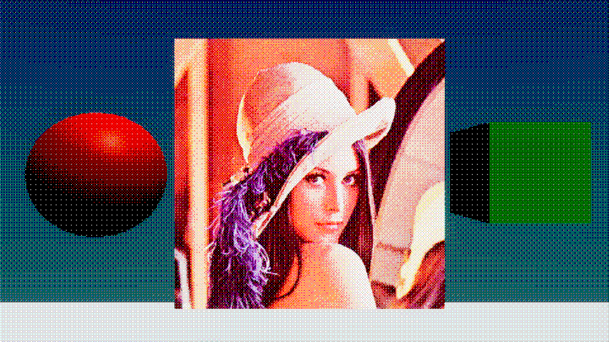

# OrderedDitheringMonoChannel

An ordered dithering post-processing effect for Unity / HDRP.

I converted one of my old dithering shader effects to a HDRP post-processing effect when I was learning HDRP post-processing and custom passes.

The effect itself is quite simple but the setup of render targets etc. without proper documentation really wasn't that easy.

This effect dithers each channel separately, considering them as monochromatic, black and white images and the result is then merged.

## Features

- Downscaling of the source camera image
- four different Bayer matrices
    - 2x2
    - 3x3
    - 4x4
    - 8x8

## Notes

It's always important to remember that HDRP post-processing effects have to be added to Project Settings/HDRP Default Settings/Custom Post Process Orders list.
Otherwise they don't function.

This test project works with Unity 2019.3.0f6 and HDRP 7.1.8.

## Effect in action

